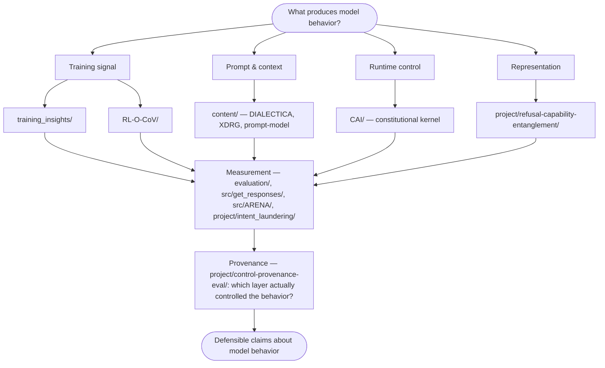

# XFN-CFPE

XFN-CFPE is a research and evaluation workspace for testing how language-model behavior changes under different prompts, evaluation frames, training loops, and control mechanisms. The repo combines completed experiments, reusable execution infrastructure, prompt/theory artifacts, and forward research projects around model behavior, constitutional control, and cross-provider evaluation. Everything runs against a provider-agnostic execution layer (Anthropic, OpenAI, Google, xAI — 22 models in one catalog), so claims are about *model behavior*, not one vendor's playground.

The core loop is simple: state a hypothesis about what should govern model behavior, implement the prompt or intervention, run it across models/providers, measure the result, and keep the artifacts inspectable enough to distinguish surface compliance from the mechanism that produced it.

## The organizing question

Every directory in this repo is a position on one map:

Four levers produce behavior: what the model was trained on, what its context says, what the runtime permits, and what its internal representations encode. The measurement layer is shared and cross-provider. The provenance layer asks the question most evaluations skip: when behavior looks aligned, *which layer did the work* — and would the behavior survive if that layer were removed? The empirical anchor for the runtime-control branch is a 1,520-trial 2×2 experiment ([CAI/](./CAI/)): external enforcement produced 0/760 tool-channel violations per model while self-critique alone could not, and all residual harm under enforcement was text-only — the two surfaces need different mechanisms.

## Main Surfaces

| Surface | Role | Status |
|---------|------|--------|
| **Research artifacts** | Completed and active experiments on constitutional control, provenance, intent laundering, and refusal/capability behavior | Active |
| **Execution infrastructure** | Cross-provider prompting, response capture, and multi-turn arena experiments | Active |
| **Prompt/theory substrate** | DIALECTICA, DIALECTICA-RIGOR, prompt-model notes, techniques, and test queries | Active |
| **Training insights** | Standalone package for multi-dimensional checkpoint evaluation and training-loop diagnostics | Active |
| **Documentation/designs** | Architecture notes, evaluator specs, and template-generation specs | Supporting |

## Key Artifacts

| Area | Artifact | Notes |
|------|----------|-------|
| Constitutional control | [CAI/](./CAI/) | Constitutional kernel experiment: 1,520 trials, 2×2 conditions, 0/760 tool-based violations under kernel |
| Evaluation integrity | [CAI/POSTMORTEM.md](./CAI/POSTMORTEM.md) | Incident report: a mention-vs-use scoring bug flagged 19.7% of trials; detection, retroactive correction, preserved raw data |
| Control provenance | [project/control-provenance-eval/](./project/control-provenance-eval/) | Evaluation frame for identifying which layer supplied behavioral control |
| Intent laundering | [project/intent_laundering/](./project/intent_laundering/) | Methodology and seed-example analysis for request-layer intent-laundering detection |
| Refusal/capability geometry | [project/refusal-capability-entanglement/](./project/refusal-capability-entanglement/) | Activation-steering pilot on Llama-3.1-8B testing whether refusal direction is geometrically separable from capability |
| Prompt reasoning | [content/prompts/dialectica/](./content/prompts/dialectica/) | DIALECTICA versions, including current `v0.3.7` |
| Anti-hallucination prompting | [content/prompts/XDRG/](./content/prompts/XDRG/) | DIALECTICA-RIGOR variant |
| Cross-provider execution | [src/get_responses/](./src/get_responses/) | Provider adapters, model catalogs, CLI, and response processing |
| Multi-turn evaluation | [src/ARENA/](./src/ARENA/) | Debate/escalation runners with a full scoring pipeline (rubric → cost → composite reward) |
| Training diagnostics | [training_insights/](./training_insights/) | Composite reward, checkpoint evaluation, and experiment reporting |
| Reasoning-execution RL | [RL-O-CoV/](./RL-O-CoV/) | Resonance-shaped RL: train the execution of reasoning, not the answers |

## Directory Structure

- **project/** - Public research-project surfaces
  - [control-provenance-eval/](./project/control-provenance-eval/) - Control-provenance benchmark and methodology
  - [intent_laundering/](./project/intent_laundering/) - Intent-laundering examples, prompt, and pilot results
  - [refusal-capability-entanglement/](./project/refusal-capability-entanglement/) - Activation-steering pilot: refusal-direction separability vs. capability
- **CAI/** - Constitutional kernel experiment
  - [README.md](./CAI/README.md) - Hypothesis, design principle, and results at a glance
  - [results.md](./CAI/results.md), [status.md](./CAI/status.md), [POSTMORTEM.md](./CAI/POSTMORTEM.md) - Results, claims ledger, incident report
  - [analysis/](./CAI/analysis/), [classifier/](./CAI/classifier/), [experiment/](./CAI/experiment/), [kernel/](./CAI/kernel/), [results/](./CAI/results/) - Experiment components and tracked data
- **src/** - Shared execution and evaluation code
  - [get_responses/](./src/get_responses/) - Cross-provider execution engine
    - [providers/](./src/get_responses/providers/) - Anthropic, OpenAI, Google, xAI
    - [catalogs/](./src/get_responses/catalogs/) - Model registry and pricing metadata
  - [ARENA/](./src/ARENA/) - Multi-turn cross-provider debates and arena runners
- **training_insights/** - Standalone training/evaluation package
  - [README.md](./training_insights/README.md) - Architecture and composite-reward framing
  - [core/](./training_insights/core/), [evaluation/](./training_insights/evaluation/), [tasks/](./training_insights/tasks/), [tests/](./training_insights/tests/) - Package internals
- **content/** - Prompt, theory, and query substrate
  - [prompts/dialectica/](./content/prompts/dialectica/) - DIALECTICA versions
  - [prompts/XDRG/](./content/prompts/XDRG/) - DIALECTICA-RIGOR anti-hallucination variant
  - [techniques/CoV/](./content/techniques/CoV/) - Oscillatory Chain of Verification theory
  - [techniques/prompt-model/](./content/techniques/prompt-model/) - Mechanistic prompting framework
  - [test-queries/](./content/test-queries/) - Test question sets
- **evaluation/** - Benchmark/rubric layer
  - [benchmarks/](./evaluation/benchmarks/) - Rubrics, methodologies, test cases, and cost equations
  - [benchmark_data/](./evaluation/benchmark_data/) - GPQA, MATH-500, MMLU, GSM8K, HLE, and related datasets
- **data/** - Experimental outputs and analysis artifacts
  - [haiku/](./data/haiku/), [sonnet/](./data/sonnet/), [opus/](./data/opus/) - Per-model results
  - [analysis/](./data/analysis/) - Evaluation reports
  - [arena_results/](./data/arena_results/) - ARENA output artifacts
- **documentation/** - Supporting documentation and design specs
  - [designs/SYSTEM_OVERVIEW.md](./documentation/designs/SYSTEM_OVERVIEW.md) - Pipeline architecture
  - [designs/rft-evaluator/](./documentation/designs/rft-evaluator/) - Preference-pair generation spec
  - [designs/template-writer/](./documentation/designs/template-writer/) - Prompt-variant generation spec
- **plugins/** - Plugin/skill packaging surfaces
  - [prompt-model/](./plugins/prompt-model/) - Prompt-model plugin materials
  - [training-insights/](./plugins/training-insights/) - Training-insights plugin materials
- **agents/** - Pipeline-automation agent designs and their implementation status ([agents/README.md](./agents/README.md))
- **RL-O-CoV/** - Reinforcement-learning experiments
- [system-design.md](./system-design.md) - Original closed-loop pipeline design note (generate → execute → evaluate → iterate)
