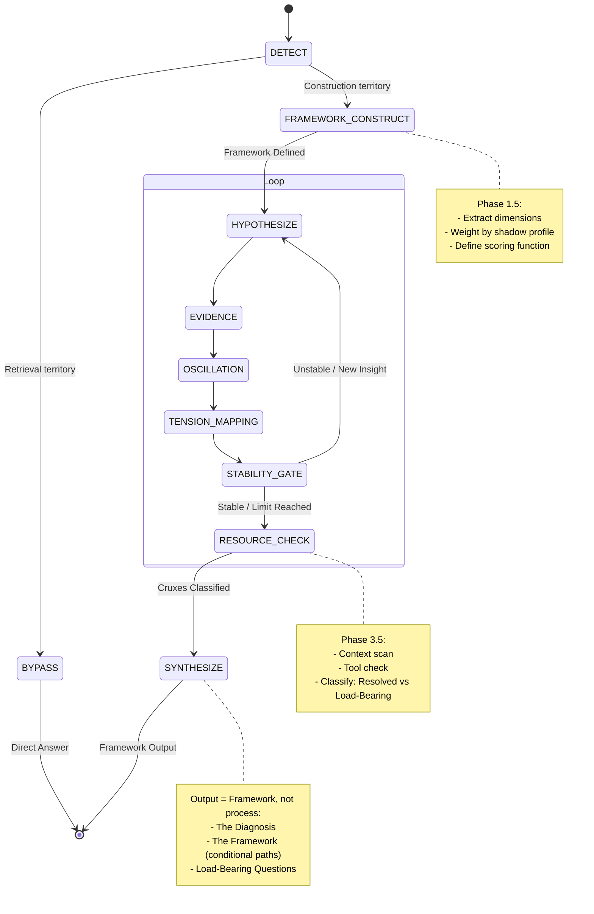
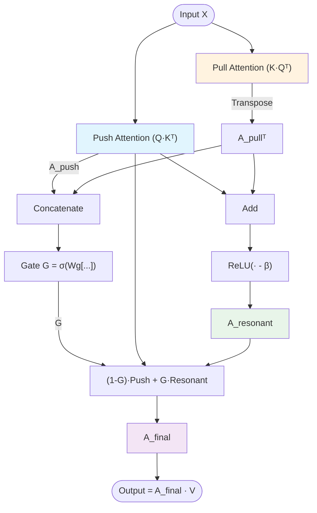

# Oscillatory Chain of Verification (O-CoV)

## Overview

Two implementations of bidirectional verification:

| Layer | Name | Mechanism |
|-------|------|-----------|
| Prompt | **O-CoV** (Oscillatory Chain of Verification) | Hypothesis oscillation + framework construction |
| Architecture | **CC Attention** (Cycle-Consistent Attention) | Bidirectional attention resonance |

**Core insight**: Unidirectional flow cannot verify itself. Linear CoT compounds errors. Standard attention allows parasitic dependencies. Both fail on "construction territory" where no pattern exists to retrieve.

---

## Part I: O-CoV (Prompt-Level)

### The Problem

Standard CoT: `Input → Step 1 → Step 2 → Output`

**Failure modes**:
1. **Drift**: Errors in Step 1 compound. No "look back."
2. **Retrieval dependence**: When no framework exists for THIS situation, model pattern-matches to nearest category → generic advice, literal misinterpretation, refusal to commit.

### The Construction Principle

| Territory | Framework Status | O-CoV Value |
|-----------|------------------|-------------|
| **Retrieval** (well-analyzed) | Exists in training | Verification only (rigor theater) |
| **Construction** (novel/personal) | Does NOT exist | Builds the framework (token cost = construction) |

**The core claim**: For personal, ambiguous, or novel queries, no pre-existing framework applies. The oscillation process doesn't just VERIFY—it CONSTRUCTS. Dimensional extraction, shadow profile weighting, and scoring function definition are the construction work that cannot be retrieved.

**Detection heuristic**:

| Signal | Points |
|--------|--------|
| Personal/specific situation | +2 |
| No pre-existing framework for THIS situation | +2 |
| Contextual variables matter | +1 |
| Ambiguous or novel territory | +1 |
| Well-documented topic with established frameworks | −2 |
| Generic question (not situation-specific) | −1 |

Score ≥ 4 → Construction territory → Full protocol.

### State Machine



### Output Format

**User sees the building, not the scaffolding.**

```
## The Diagnosis
[Core tension in 1-3 sentences]

## The Framework
Path 1: [Recommendation] — Assumes [X]
Path 2: [Recommendation] — Assumes [Y]

## Load-Bearing Question
[The ONE question that collapses remaining uncertainty]
```

Process logs (oscillation, hypotheses, red team) stay in thinking block.

### Confidence Metric

$$C = f(\text{oscillation\_complete}, \text{framework\_constructed}, \text{cruxes\_resolved})$$

High confidence requires surviving adversarial loop AND constructing (not retrieving) the evaluation framework.

---

## Part II: CC Attention (Architecture-Level)

### The Problem

Standard attention: Query asks "What Keys matter to me?" → Unidirectional.

This allows **parasitic attention**: One-way dependencies that aren't reciprocally validated.

### The Solution

Add reverse pass: Keys validate relevance to Queries. Only **resonant** connections (bidirectionally agreed) survive.

### Mathematical Formulation

#### Phase 1: Push Attention (Forward)

Standard attention computation. Row $i$ represents "What Query $i$ wants from Keys."

$$
\begin{align}
Q_{\text{push}} &= X W_q^{\text{push}} \\
K_{\text{push}} &= X W_k^{\text{push}} \\
V &= X W_v \\
A_{\text{push}} &= \text{softmax}\left(\frac{Q_{\text{push}} K_{\text{push}}^T}{\sqrt{d_h}}\right)
\end{align}
$$

#### Phase 2: Pull Attention (Reverse)

Reverse attention where Keys validate their relevance to Queries. Asks: "Does Key $j$ find Query $i$ relevant?"

$$
\begin{align}
Q_{\text{pull}} &= X W_q^{\text{pull}} \\
K_{\text{pull}} &= X W_k^{\text{pull}} \\
A_{\text{pull}} &= \text{softmax}\left(\frac{K_{\text{pull}} Q_{\text{pull}}^T}{\sqrt{d_h}}\right)
\end{align}
$$

*Note:* Transpose $A_{\text{pull}}$ to align indices $(j,i) \rightarrow (i,j)$ for resonance step.

#### Phase 3: Resonance (Mutual Reinforcement)

Amplify connections where both forward and reverse attention agree. Filter "parasitic attention" (one-way dependencies).

$$A_{\text{resonant}} = A_{\text{push}} \odot A_{\text{pull}}^T$$

This is the **resonance operation**:
- Connections that only Push wants → negated
- Connections that only Pull validates → negated
- Connections with mutual agreement → preserved AND amplified
- Result transcends either unidirectional view

### Gradient Stability: Gated Residual Resonance

Direct element-wise multiplication ($\odot$) causes vanishing gradients when one factor is zero. Solution: **Gated Residual**.

**Mechanism:**

1. **Gate Calculation ($G$):** Learnable decision on verification strength.
$$G = \sigma(W_g [A_{\text{push}} ; A_{\text{pull}}^T])$$

2. **Resonance Calculation:** Addition + ReLU preserves gradient flow.
$$A_{\text{resonant}} = \text{ReLU}(A_{\text{push}} + A_{\text{pull}}^T - \beta)$$

3. **Final Integration:** Smooth interpolation between unidirectional and resonant.
$$A_{\text{final}} = (1 - G) \odot A_{\text{push}} + G \odot A_{\text{resonant}}$$
$$\text{Output} = A_{\text{final}} V$$

The gate $G$ learns WHEN to apply verification:
- Retrieval (familiar patterns): $G \approx 0$ → standard attention suffices
- Construction (novel combinations): $G \approx 1$ → resonance filtering activates

**This mirrors O-CoV's bypass mechanism at the architecture level.**

### Architecture Diagram



---

## Unified View

| Aspect | O-CoV (Prompt) | CC Attention (Architecture) |
|--------|----------------|----------------------------|
| **Unit of analysis** | Hypotheses | Attention connections |
| **Negation mechanism** | Cross-examination, red team | Resonance filtering |
| **Preservation criterion** | Survives oscillation | Bidirectional agreement |
| **Transcendence** | Synthesis exceeds any single H | Output exceeds unidirectional attention |
| **Bypass/Gate** | Construction score | Learned gate G |
| **Construction trigger** | Novel/personal/ambiguous query | Novel token combinations (high G) |

### The Claim

> Standard AI reasoning is unidirectional → unverified.
>
> Linear CoT compounds errors. Standard attention allows parasitic dependencies. Neither can distinguish retrieval territory (where patterns exist) from construction territory (where patterns must be built).
>
> O-CoV introduces bidirectional verification at both layers. Cost: 2x attention, N iterations. Benefit: Outputs constructed through genuine opposition, not retrieved through pattern-matching.

**Vision**: CC Attention model + O-CoV prompt = double verification.

---

*"The truth is the whole."* — Hegel
